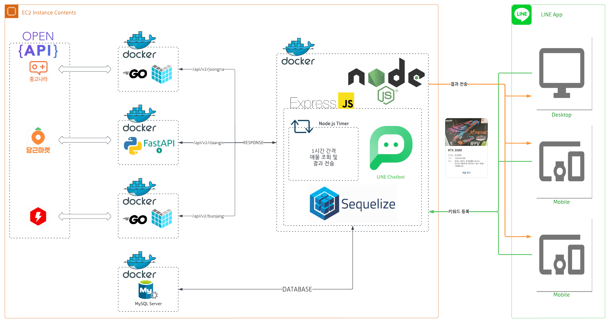

<p align="center"></p>


## 매무리 봇 (Mamuri-bot)

사용자에게 입력받은 키워드를 통해 3곳의 중고매물 사이트(중고나라, 당근마켓, 번개장터)에 매물을 감지, 알림을 전송하는 봇입니다.

## About The Project

- 봇을 사용해 키워드를 입력 받습니다.
- 주기적 크롤링을 통해 새로운 매물을 감지해 알림을 전송합니다.

### Project Architecture



### Built With

- [Node.js](https://nodejs.org/ko/)
- [Express](https://expressjs.com/ko/)

## Getting Started

### Prerequisites

- Node.js

### Installation

1. Clone the repository
   ```
   git clone http://khuhub.khu.ac.kr/2018102211/secondhand-noti-bot
   ```
2. Install NPM packages
   ```
   npm install
   ```
3. Start Project
   ```
   npm start
   ```

## Contributing

프로젝트에 기여하고 싶으신 분들은 아래 절차를 따라주시기 바랍니다.

1. 프로젝트 fork
2. feature branch 생성 (git checkout -b feature/name)
3. commit (git commit -m "Add feature)
4. push (git push origin feature/name)
5. pull request 생성

## License

MIT 라이센스 아래 사용 가능합니다. LICENSE.txt를 통해 자세한 정보를 확인하세요.

## Contact

- 유명현: mhlew0106@khu.ac.kr
- 윤준석: phobyjun@khu.ac.kr
