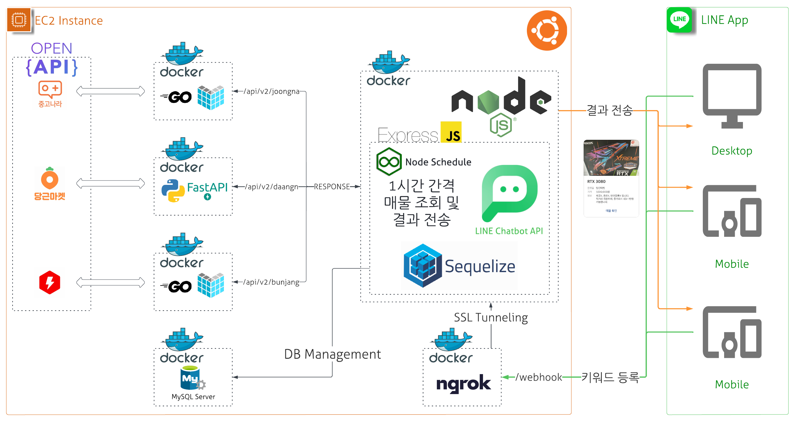

[] (https://nodejs.org/ko/)
[] (https://expressjs.com/ko/)
[] (https://go.dev/)

[] (https://go.dev/)
[![goecho-4.7.2](https://img.shields.io/badge/Echo-4.7.2-blue?logo=data:image/png;base64,iVBORw0KGgoAAAANSUhEUgAAAMgAAADICAYAAACtWK6eAAAbWUlEQVR4nOydX2hbWX7Hf+fGTNxladwplFkoa3lIpiksE5t92MSBiTQvsbO7xIKCNfQhmnhK7HTByvRhZh4iHSmFplDG8kMn9rIe27BlZSjIhiVxaFnJC7bTl7W8T9lNWEt5SmH/xNCHJDj3lHP/2JJ977mSfHXvPdLvA0OG2Jauc+9X5/f/pwCCILagQBBEAAoEQQSgQBBEAAoEQQSgQBBEAAoEQQSgQBBEAAoEQQSgQBBEAAoEQQSgQBBEAAoEQQSgQBBEAAoEQQSgQBBEAAoEQQSgQBBEAAoEQQSgQBBEAAoEQQSgQBBEAAoEQQSgQBBEAAoEQQSgQBBEAAoEQQSgQBBEAAoEQQSgQBBEAAoEQQS0lUAopSG/rwE5YH19nW5sbCxvbm5Ke1+I3xfgBpTSHkJIgv8HACVVVROU0pLf19WpbGxsjABAFgB6zb/b29uLfvDBB8v+XlnjSC+QO3fujDDGam4GhzH2USqVyvl3ZZ3H+vp6PyGE34tLFl9+SQiZuHDhwoIPl9Y00gkkFAp19fX1/SAcDl8mhAzxv7L51j0A+O9CobACAKuFQqHs8aV2BAMDA389PT39SVdX12UAOF/Hj/D7UJybm1vZ29tbXVxcfOnBZTaNdALJZDL8mL7axI+uGKYXCsUlNjc3w4yxnwHAO02+xC63kAcHB7MuX5prSCOQO3fu8JuxcNiUapBdbo6lUinq4qV1HNzpNszaZj6orKgQQuIXLlwouvR6rhF4gVBKQ4qiuHkzwLghidu3b0vnNPpJoVDoeeutt8xgyKkWvMXK3NxcfG5u7kULXrspAiuQqshUqoVvs/aLX/xipFgsBuaGBBWryFQrYIw9fP36dSwSiQTingRSIJlMJs410uqbAfoNKTLGopTSQNyQoOEQmWoVFQBIDA4O+n7CB0oghp9BPb4ZYDiLiWQyKVUIspVcu3at+8aNGzP8f328jDXGWOLixYu+5bQCI5B0Oh0jhPzM58tYwySjzsbGRrPRwlYw/erVK+qH2RUIgaTTaUoI+QwAuv2+Fg4hZPHNmzeJTjS7jNDtcaOFrWCX+6ReJxp9rcWilPZnMpmy4YgHQhyg+yXXFEUpG75QR6GqahgAevy+DgtOMcb6vX7TE16/YTXFYvE5/yMUCv0vAJwmhPy5n9djUGKMLRYKhX/e2dlZLZfLe35fUCu4fv36O1tbW/93+O+//vrr4t7eXlZRlBff+ta33vNZLGUAWJ6bm0tvbW1N/OhHP/LcaQ+EicUJh8M9H3744bIPDroJ9z/idpn2SCTSH4lEFhhjyzInGsfGxnrGxsay3PkmhGwDQEKUoPMqvHuIwCQOvRdIfisE0QHbcg+XMuaN8JwQ8tHt27dtbwY3BRVFyVfVfWk3UPQzQcRI9OUIIZcPfWnFsO9t78v6+jptYYKwmqXBwcFYi9+jbnwQyDZ/qF4AqAmRUDKZTMLIhbTyhlQKhcJIoVCwjFpRSntOnDiR5T6Jzc8LT50gUcdJoJXhXLx40fZ0NEpMaItCv9r7//jHP74rKmAc2mEhogB90Es88Q/9EohpRqUB1CxEByyjRUY2nX9yTbp8FY41WY0IlDGW5q8XxKhXE4k+xySdEelyM1+1+OrVq4QojDuyw3peK8DviVZZcb+XePLs+i0Q0G8ISUD0fdsbYtRjLbhxQ5we5mOYePzBokFJNnJz6uTJk/whbvbD5ZZTle3m5macMTZ1DEfe0bTjXHnG4sBqKys6SSAG7AuI9t8V/ajRHDXfzA0xchvUzhxyqyiSMfZFKpUS/h6tZmNjwxXzlH+YvH79Oiv6ZP/lL3851NXVlWvwvda4ZeDkhF/ZYf1AIAvk6PPSgQLRmAZQqZ3JBXq0K2xEu+q9IdrNsHOow+FwdyQS+dzNokjG2DQ3Qbw2ubjpw/0Mxtg5F1/WMUHXgG9SV42VYU4JT79OFQiYTTQQPWd7vNfhPHNeEEKiTpGmTCaz0Cqn0zC5PGkG2tjYGAeAey18C8e6KAffZGVwcHDE6U3OJFLnz9yiq04fgJ0sEAO2DcASEB1wCr9aOaDC6BR4Wxi5bfSetCQkXNWj4VWpjqNDbfgmWeMhrys6xfnBDgurCtTVoYgCOeAxAFuB3MwqAHsES7NH/pEjkchZABgKh8M9hUKBv/6jYrF45Pu4eRaJRMKEEO5neF22UGKMPSwUCqvFYvFYYrl+/fo7hJChsbEx/nv4URry0uwr/9WvfpXb2to6IpZr1651d3V18X/jx3YNUGcnU91vCJw/naBDhGi+39l6LwAFYk0FcjNDsHTvcSM/5EPy0Ql+woUbHSRhRKayPpegH+YxIWTYKRJ1mOFnbISw5jP0KBB7ygBqRJRkNHEzPNwCyqqqRupNMhr2fSPBCS/h/la8ngYnUWSqEbwSiIyTFUMAyg7kt7OQ3wpi1Wm9NDTu5sKFC0Wj1KPSuktqihf8upzEwc2pKxWWBQW2jisOL5HxBKlmF4DERUlGCKaJtVYoFOLNzOryYHBCI+zu7e3FPvjgg1Wnb7xSYTkAGHXrjdHEqp81iJ4L1/ONHtV3iXCcppLJZOLf/e53P3777bfnXco9tIq6u/yuVLTrdHX4BppYLSCZTGZVVeUP1rTHb81t9FvJZDJkJw5+ymUymRIAzJ88ebKXMTa/sbFRvH79umXIkzvFg4ODcUJIRPuQ8I5FQkjf4OCgMNTbLrSvQPKlz63+mlL6IpVKJVRVHfDgwdpljKW5KO0ShpTS0J07dxYYYwUAOJwBv/TJJ5/kuVll9wbcNxkcHOQn6KLrV1/LGhcjF6VdxIo74EM7TNpJ7la0r0CA/IvIkaeUlpLJJH+wZlvy7oQsqqran0qlbEtO0uk0VRSl5FARcP7kyZNlo77KltnZ2XEuxmNf+FEqABDlIrSrnRrZYT3DFbbAHfAu+1nJUtLGAtGYBFDKkN+2fbiSyaT5YO269J5lVVX7bt++LewTyWQyM0b9Vz3+EP+eqc3NzZJRb3WExcXFlxcvXqTc/AGAlWP9BjovCSEfDw4OhkQRqjOJ1PnXCpRJsHIzrtHl9wV4gPZwQb70GQCsQm7mIQBbhaXZ/U91/ikfDofvEkKG6pgabwV/rWKhUHi4s7OTK5fLR06McDjczf+IRCL89UcafH0NowixsLGx8ZiL4Cc/+cnq119/XfOpbpg/I2NjY/z1h8bGxi7zPxsoQynt7e2tzM/P/3R+fv6p1Tecnkz1EAJD7yXoZUbg7wDgm43+LrLQvlGs/DYT/Myu3l1n36xlt3fk8OvUMwy70ejZ4OBg5Rvf+Ea9IWnHCtmq0LAokrRm9IHbnnpVTUu2IWZFhcjP+0iNaDGKJR+n9BumlGB0wrL+5/bt28vJZDJkZ36ZzrdIHFWRqakWhpa5kPIiHyUSibyoMr8Ol+mYzndYJI7hZ2zktQIl40H3O//iGZ0qEJNeiI0/gPyWbeEiFwB3trnpAQfOd5/I+aaUhjKZzLJNZKpVTK2vr1OHiFd5bm5u2JhmUjF8DFvnG4zI1JUyKxIG+QAlWj2jU00sK4TNWpFIJPThhx+GnMrWKaVDiqI02mFXQ4Mm1mFcmUB4djLV/e6n9G6jLbtoYrUvRsTr15bTMgqFQtlJHNxvURTlZz6bIKfMJOP6+nrTJf3vfkpzx+hnbxs6IYrVCKcA2DzkSwmnZq1qzMYtxpgrJ2N3d/dfufAylwghWxsbG44NTtVoTUsnIAvMM9Mw0OAJYgk5B6AUIL+9oA26c+DEiRM9bjYtKYryZ269FuiCc7y2oR0WGq6wBVWBAorjAD8EItM0wmtapCu/LQzjctMrmUxyc+bjRsvYW4hjaYgJ9xEUBUrtmuw7Dt4LJHqOAnhSB+UWekh4dNyxYjiZTC6oqhr15rJsqVSFbYUfRvzUuFJhZalCtwzWFBUiXr2dPz5IdKCk9VKP3ggBkBGITVxqMNvrP/ntPOTurRhZ+efmX1NKV8Ph8F8QQoYikchlABjxoGf8paqqP52fn//3ubk5y0EVZyZT7wCBoT9uFpf/8D9rmj/SBRBSgx+65Sfy6pMpusYIrD6dSjfUbn1c/HXSl2bLWkZ7aSYL+dIQADlWeNRjuLD1MTaxm4vGrGHtwTOWguYKhQL/fT5ucR+KsC9jZIf1vFIga5pPTxktmgIJOFq1w1sqZJf7iG/X672Jlf/1iGWFbbR/FUANeVC23QquiYoiW9SHsuLUl/H9CkvIWEjIABbfUiF0v5dQP8UB/jjpLGGbb+CfwNFzcQDVrYpULzGLIu36Psw+lL5j+l+m8z1i53z/YIeFuW/BWlvi0hKYCrce9JK4nTCuPGPxKxXmmWj8CvOa+YYS5LeOOr/RgTJEz41o00vkceYNyCTkt5ftwsOU0rLRh9LoaeLYl2E43ctaqDb4vkUthvP9oI9YfsBoon/GSsBg3kvR+5wHqco3jN6wMLsGinoZCYkGcJqHiKvG5BVq17CVTCa5OXarjj6UuvoyflhmQ4oCOwHaTFsvFSDw8f0QCR8uUYEA5GeCkii8BrGbOduvRt9fhui5kPFABSXPUA96xTD3uyyowzfZ3dvbizrVVXGz4w0Bv1doNwr/YEjf7yWh+98mlr9fEPIzQREI5zLkt8uWJpeJNtCaRV3s/vOCXgCW14o0LaqGD/fId3XtBxYXCSH9opE6ZqWtYXbINCMsbTrhVl8cfsZGgpKfCVotVq9hcq0BqHHL6YnR/lX9QVP8HHnTDJcAlC3Ib1tWDVNKtdzQ1NTU3xNC1utoXDrOchxfYACLTAW62kfs+052WIIwLbgQCIJ0glRzSWjD60583MjIy1S6AvtVw6Pj562+eOvWrf8QicMM3comDqJC+kEviduJg4uem1RECY44IIAnyGG4Df8Z5LdXjax10Ugu6ugZedsVBwHmFMTG/wti4/9p1SNfzdvfu9T9lxfCI0b/9xCrYzVA0Pjdl/Tu4+n0Ed/xvclUiBEIn7lFr74OaCVF0AUCxj9aVdZ64iOI9ts79NJAvgkAcYhNxDWfKvaPR0aoGqYU/10vN9r9FSQOi+Nwdj/IBNXEEkDmnaprddiEF1fjEqcA2BEHfk/fYXJ4p3lwYbDW5XCiczNKpuy+hALRTpSUc8Srf0bORKOEGEm++yEStsuAc3MqKJGpRpDBxLLDjHhNQ/Sc9UQPvSMwrOchHEf4IM2xeD8kXuo/tMNCCpEwuy/pCXIY577r2kSjTDmUIGMm+oTiAK1DEuJA5BxJ2g4CscaydOVc1qgYdnPUaCciTPS1E+0rELvSFb1imAJos65kLK33DQawqKrQZ1eGzh1wbcVaGyGzD+KEXroCJGG5gUrP0schX3qsTYJH7OFOOANqVUwIhxZyKvIlboW07wmiU10HZW0DR/vv6tEutu351QWfihmdshWHXhrStlMX210gJmbpSgHyJQqjE7VmgFZW398PuZkBAPaFUb4iU9Wwm2g70P+0Wfzofi8JWQnjzK1U/w/LjF6psM2glYa4TTubWFaEAUgYYuMpiI2vGUWDBw/A0r2S9h/AXb0GTJGuIPA4cB/jpAoJu1yGNlSOAAUCl954f3m+0CkniBWX9DxKKWb5Vd2ZT0ja/tsYDNa4823X6mpukNKaliRa4ewGnXaCWKCVrpzVI1sW6M68ZcOT7OwBlLsshk1Xo5WGACSIRNlvN+nkE8SkvtKVNmS1j5TtxCFraYjb4AlygHOzVi1p0aaloMLqCD7IXBriNniCHEXcrGUiWbLRTPI9mU4/t/ses2lJG/4gaWmI26BA7DEHLtjXGtV2NgazatgcpyPo5gNj8IPRqejqohvZ8UEg2twjWUb49Orzu7aLMHrDvpMvOlDSxxNpCUfbT2iPcUzywdHBD7KYi549Pz5Md5eysvYSALFc9llDdKAIudlhnz8AdrU5UzZJvmq0uikFtiQK3e6PCvLqDf1z0qPnsjB6YwaAnIfY+FUAEgOZ+q3z21sA7CHkZlZhaaY22QjqWeP3CgOQywBgOaDBTQiD3G+zdPYEg0eHW1zPTqa63xA4fzpBh343Rf/tN9Pp34P+6dijtvrCjgkDKAGD4tMsfXiCQdGqt72V+D3dXStr0B6w0Rv/alTgyvJp1g9A+iE28RnEJio1RZHVvxcA1evAlGxLph4yWFMZ2PoX1YWE+rfDDAD83vXrcBuHAkmv8GG6uxYdOppvWJp9fmDHS+OjmBwURVqPUHV/1nBVm6uVOLQ5vXKub37BCERFvpOXJfV+RLHCVfv/7ObxhgDIxxIK5RLEbj6wDQ/XzhpudkK5cJatEarNGqFaWU5jk90nWRp58G1iOYPYLHnR/CaP8DPMa+7UsCnxeH/ByDPI1v13XrROWoObYrl7ww3+Xs6zbA9CtbIVWO6aXYpPptKWU1H8mobidx7k1H6Zh7aO7RAH3X+yLdYRr3fgLM08aqD917HF9ftldleyUK2GkcDst+tSNHed+FXy4rdATHohdrNg39RUs1jH0x11x8NhnXRN+69qaW+rTAvZ2m5aMtcDMAKfteAXaB1VFcQiH8rvXSdBEQgn5FjiwZ3d3FfDgc1a2yNeJ6058QNHBMJ9jNWQtTkFAVkP0DAOwYWzk6nuqnIX332oIAnEJCW04Zdmy5Iu1TnlVtVwkNYDNMALUXDB5N1P6UKQyl2CKBA4sOGtd2po7GfkVdlGzxhVwyXrYXcCpA3dEig/maJRu+ACVJe8AIx6e3Figl7ubu7UKAGwFSNr/ajmOyxMEzkgU5DfvgrA1iA3u2y0+h7h7fOX3rmYK46/0c0NKftV7IRxJpE6fzZBh/aIlkAN5LigoAvExMxapyA2Pg3R/jo+fdlzABL00pXqHvlb+mC7A8y+jDdtVnqu9bYrwEXT+0Y7YIJLUE0sAeItsvv4XzTYKEcCE10AIYn6MrQiSZF/IeMWXgkFouG4RdYoGpQx0SgbL/fzNAIfQ9YtvLIKxCQFoNhvgK1NNDa6lxypA8UhTwOGSSXhFl4N2QUCdW137aQRPl5hJPp+HiKO275URQsuyLSFd592EIg11qUr7lfVdhoOib52o30FIi5dcaOqttMQVhGbORpuTvlzea2hfQVSV+lKU1W1nYawijhopSFu084CMXEoXWmoqrbTcKwiDlppiNvIkig8LmbpSkrbtZ6bWTF2k+v9zdyJB6AweiNrJO4uA5Ah/RTqMJjWc1H8TZZOP80e7c3gJ8YegaG/SdCrTM/st/W/UacIxCQEQKp2k9+kNdlrfZn/MizN6B1tWlEhyepl621PRVEh7jSn15wmKfPe9kboNIFUcwoApiBfCtmWruh1Xv26eWYf55ecXSCQECX5qktDvL00/+lkgRhopSshADVhO49Xa/9tP7Sl/yqERM1YigJZVbLst5ugQHSuAihXIb+dBlCzhk/S9oiy3z8ss6E3BB54e0XBoxOiWI3gPI93HwmTjQzW1DryPleesbispSFugyfIUcx5vHHD7LLs0zD8kzDkfz0CwLIBt88rQIDe77X3M8CcN0UgC6z98hnNgieIPWazlvX8LpNgzxp2HBUEh+dNtWGy7zj4IBA1LtkIH31+1+iEeHi1Fi7WEo4PPbsyMY5JPs73Kyzhx7ypY+JZwakP0933d2rIZMOfAmDO3Yncuc99FfPzA8BclONUgg5G+JaBtsZZjsEPZqFkL/FsZ6SP090NG16ruiUjEJsYA4Dv+HY9jZLf/hMArELu3kMAtmwkGfVk49JsHEZvfK5l42Pj3GQZanH774s/bhSzf3xUXPztdPpIqPr0ZKqHEBg5fYtefvolvSXaMhUwtCHgT6boQ0Zg9elU2vOZaP476Uuz/IZmAdgMxG5+LtHeP+6XxCA2wU+MeYjdnDb2rptC4Q/hAizN6La/FhnTMtFuOvPCJB/3LV4rULPrnQB84eL7twruO2XfUiHrdAq2muA46UuzLyUdM2oyafgqdmOK3Jw1vOvU5irrnF4GUBKNIvWa4AjEpHbMqCw+iskpiI3nbQfD1bYAP2rmDbiPYTrftrNsn7GSjHN6uY/x9Es6HKRGrOAJxER35sOSOfNg9KHYr3eAfWd+uKFoTNUsWythnJ1MdQ9X2II2MYSBXMWVBLbNLsWg+UfBFYjJQfefbPtCxOsduDNfT/svg3I9La7vfkqXJQvVwn6X4rdJv9+bpOwIvkBMuA2vJ+SCkmeoB+d5vPsfAGr28Jf2AMpPpmlU9PBUrQe47PK1txLTh+oXJTCDgP9RrEbJfTViRLtk6mIz5vFur2mJUquqYYsCSdGJYUxdXFDly3xPv6VCIBzwepDnBDE5iHb1SRjturTfJz96o7uZFzBWrMnYA/7YSGAmZBEHSCkQk4OMfB2Vt4EjBbGbDZsWVaFbmU5PYARKQYtO1Yt8JtZh7Jqcgs8o5Le/p/XG52Ye1vTIV/FeIvWdMwn6T1r/N5Oz/9tuKacMyC8Qe0pBHalfRQiAjENsYlxLIC7N1kS8tPJzBTYZQFPmmB/U028iE/KaWE7kvorIPmZU0ctZ5BCHkae530es+2ckpX0FUm+eATkuz9t5FGn7CsRE3kSjDFSeZOlwUJN8btDOPkgt+mSSBchvJ7QhcbLVKQULrdrWqRmrHWj/E+QwB51/ab8vRVKm6+lUbBc6TyBQU1XbZ0S7EAeqOhWlSvQdl84UiEl0oGxU1aITb4fR5vqgl8Tb0Ql3orMFAkbn30FZPTrxB7xgBKJOi//bHRSIiR7tCkFuZgCAfQEARaMnupPQesBPMEg/Gg3/rcwZcLfonChWvSzdKxlL/e/qDU9KFuTrs2gY7mMwFWgnmlEiUCAi9BL0OOS3qPYItSMM1lQGHelf1AMKpB7kLYgUYvgWbbVT0G3QB2meoI0ZRVoACqRppEw2TisAgRqKEHTQxGoWc69hfmsBQKEBd+RXVBUS6Gc0Dp4gxyXIs4arZtmiOJoDTxC32N8XUspqa938pcIIJB70Yh7juOAJ4jbaQlDfSut3tTlTvSSEST53QIG0guj7C5D76izk7kUAWLrVBZEMoPSHzeI//O5L+k7Q50zJBvH7AjqG/FbIyMrbbYxN6xXGBxjrlwu2r4lJvpaDJ4hX6M68Oy3AVbNsURytBQXiNfstwE0NvQv8LNt2AwXiF1pouO7Fn3Ut40TcBwXiJ/W1/z7qpBZXBKmbkR3Wc3oyZb+CGkEQxE/QxEIQASgQBBGAAkEQASgQBBGAAkEQASgQBBGAAkEQASgQBBGAAkEQASgQBBGAAkEQASgQBBGAAkEQASgQBBGAAkEQASgQBBGAAkEQASgQBBGAAkEQASgQBBGAAkEQASgQBBGAAkEQASgQBBGAAkEQASgQBBGAAkEQASgQBBHw/wEAAP//Z/bi4ONrrG0AAAAASUVORK5CYII=)] (https://echo.labstack.com)
[] (https://python.org)
[] (https://fastapi.tiangolo.com/)

[] (https://www.mysql.com)
[] (https://ngrok.com)

<div align="center"></div>

# 매무리 봇 (Mamuri-bot)

사용자에게 입력받은 키워드를 통해 3곳의 중고매물 사이트(중고나라, 당근마켓, 번개장터)에 매물을 감지, 알림을 전송하는 봇입니다.

## About The Project

- 봇을 사용해 키워드를 입력 받습니다.
- 주기적 크롤링을 통해 새로운 매물을 감지해 알림을 전송합니다.
- 다음의 QR코드를 통해 챗봇 서비스 사용이 가능합니다.

<div align="center"></div>

### Overview


### Project Architecture



### Built With

- [Node.js](https://nodejs.org/ko/)
- [Express](https://expressjs.com/ko/)
- [Go](https://go.dev/)
- [Echo](https://echo.labstack.com)
- [Python](https://python.org)
- [FastAPI](https://fastapi.tiangolo.com/)
- [MySQL](https://www.mysql.com)
- [ngrok](https://ngrok.com)

## Getting Started

### Prerequisites

Need to installation docker and docker-compose
- [Docker](https://www.docker.com/get-started/)
- [Docker-compose](https://docs.docker.com/compose/install/)

Need to write secret
- `mamuri-bot/database/mysql_init/.env`
   ```dotenv
   # Database Configuration
   TZ=Asia/Seoul
   MYSQL_HOST={YOUR_MYSQL_HOST}
   MYSQL_PORT={YOUR_MYSQL_PORT}
   MYSQL_ROOT_PASSWORD={YOUR_MYSQL_ROOT_PASSWORD}
   ```

- `mamuri-bot/joongna/config/.env`
   ```dotenv
   # Secret Configuration
   SECRET.CLIENTID={NAVER_API_CLIENT_ID}
   SECRET.CLIENTSECRET={NAVER_API_CLIENT_SECRET}
   # Header Configuration
   HEADER.COOKIE=NID_SES={YOUR_COOKIE}
   HEADER.USERAGENT={YOUR_SYSTEM_USER_AGENT}
   ```

- `mamuri-bot/ngrok/ngrok.yml`
   ```yaml
   authtoken: { YOUR_NGROK_AUTH_TOKEN }
   version: 2
   tunnels:
     mamuri:
       proto: http
       addr: mamuri-server:8080
   ```

- `mamuri-bot/server/config/.env`
   ```dotenv
   channelAccessToken: {YOUR_LINE_CHANNEL_ACCESS_TOKEN}
   channelId: {YOUR_LINE_CHANNEL_ID}
   channelSecret: {YOUR_LINE_CHANNEL_SECRET}
   ```

### Installation

1. Clone the repository
```shell
git clone http://khuhub.khu.ac.kr/2018102211/mamuri-bot
```

2. Put your secret files that you create in prerequisite to
```shell
mamuri-bot/database/mysql_init/.env
mamuri-bot/joongna/config/.env
mamuri-bot/ngrok/ngrok.yml
mamuri-bot/server/config/.env
   ```
   
3. Executing `deploy.sh` for deployment with docker-compose. This script will `build` all images automatically and `docker-compose up` on your system
```shell
#!/usr/bin/env bash
./deploy.sh
# docker build -t daangn-api-server ./daangn/
# docker build -t joongna-api-server ./joongna/
# docker build -t bunjang-api-server ./bunjang/
# docker build -t mamuri-db ./database/
# docker build -t mamuri-server ./server/
# docker build -t mamuri-ngrok ./ngrok/
# docker-compose up -d
```

4. Check your ngrok public URL
```shell
docker logs mamuri-ngrok
```


5. Set your public URL to Line chatbot configuration for webhook


## Contributing

프로젝트에 기여하고 싶으신 분들은 아래 절차를 따라주시기 바랍니다.

1. 프로젝트 fork
2. feature branch 생성 (git checkout -b feature/name)
3. commit (git commit -m "Add feature)
4. push (git push origin feature/name)
5. pull request 생성

## License

MIT 라이센스 아래 사용 가능합니다. LICENSE.txt를 통해 자세한 정보를 확인하세요.

## Contact

- 유명현: mhlew0106@khu.ac.kr
- 윤준석: phobyjun@khu.ac.kr